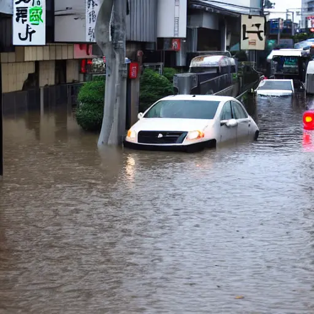
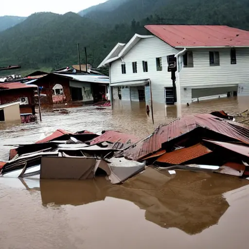

皆さんこんにちは！Sandyマンです！

先日の静岡県の水害、こんなツイートが拡散されました。<!--more-->

 

なんかすごいリアルな画像ですが、これなんとAIで作ったフェイクなやつらしいんですね。こんなの知らないで見ると信じてしまいますよね。

ですがSandyマン、思いました。**「本当にこんなの作れるのか？」**

...ということで今回は、実際にAIでそれっぽい画像を作ることはできるのか？検証していきたいなと思います！それではやっていきます！！

## 使うソフトとか
- Google Colaboratory
- Stable Diffusion

今回は、ネットを見てたら見つかった「Stable Diffusion」というAIを使用します。詳しい説明は下の方にある参考URLから見てください。

## 環境構築
今回は、手っ取り早くやるためにブラウザで使えるGoogle Colaboratoryでやっていきます。環境構築は下の方にある参考URLか(ry

## やってみる
環境構築が済んだら、下のコードを実行します。

```
from torch import autocast

prompt = 生成したい画像を表すキーワード(英語で)
with autocast("cuda"):
    images = pipe(prompt, guidance_scale=7.5).images
images[0].save("output.png")
```

少ししたら生成が完了していると思います。できた画像を見るには、左のほうのフォルダアイコンをクリックして`output.png`を開きます。

どうですか？まあまあリアルな画像ができているんじゃないかなと思います。少なくとも自分で描くよりは上手なはずです（）

Sandyマンも作ってみました！



まあまあですね！次はもう少しクオリティを高められるのか？やっていきます！

## クオリティを高める
クオリティを高めるには、キーワードを絞り込むことが必要です。絞り込むときに便利なのが[DeepL翻訳](https://www.deepl.com/translator)です！こいつにキーワードを日本語で打つと、勝手にそれっぽく翻訳してくれます！

例えば、「水害　豪雨　災害　山の町」と打つと「Flooding Heavy Rain Disaster Mountain Town」というわけわからないのが返ってきます。これをさっきのコードに通すと...。



こんなのが出てきました。反射などもかなりリアルにできています。さっきの画像よりもクオリティが上がりましたね。

## まとめ
ということで今回は、実際にAIで画像を生成してみました！このように、今の技術を使うと誰でも偽の画像を簡単に作れてしまいます。皆さんもSNSとかを見るときは、 **その情報は本当に正確なものか？** を考えて見るようにすると良いかもしれませんね！それではさようならーーーー！！！

## 参考記事
- [ Google Colab で はじめる Stable Diffusion v1.4](https://note.com/npaka/n/ndd549d2ce556#17e59775-92f3-4f9c-9e2f-84bd55f16367)