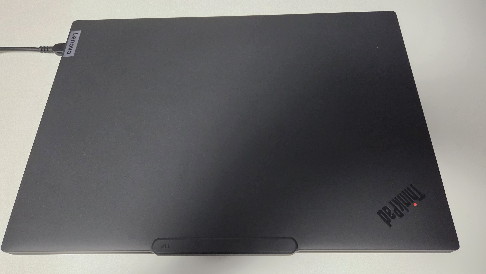
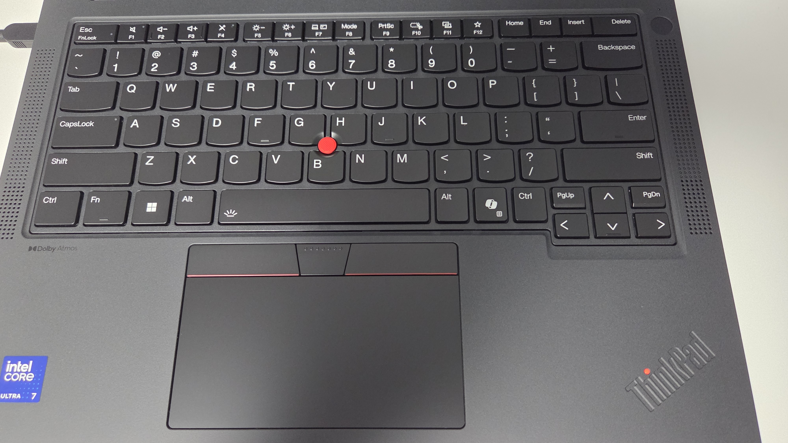

前回[こんな記事](https://www.sandyman.dev/posts/buy-thinkpad-t14g6/)を書いたわけですが、その後1週間くらい後に到着し、今日までそれなりに使ってきたのでレビューのようなものをしていきます。内容は主に前まで使っていたThinkPad X1 Carbon Gen10との比較になると思います。

## 開封

本体は主に樹脂素材でできている感じです。ついこの間まで使っていたX1 Carbonはカーボンファイバー製の筐体だったので、それに比べると質感の良さでは劣っている印象です。

厚さに関しても、X1 Carbonと並べて置くとはっきりわかるくらいにはT14のほうが分厚いです。重さもT14のほうが数百グラム重いのですが、持ち運びは普通に可能な程度の重さです。

キーボードは英語配列のものにしました。キーへの印字が少なくスタイリッシュな印象を受けます。記号部のキーピッチが日本語配列よりもゆとりがあっていい感じです。

## 分解する
今回、X1 Carbonに積んでいたSSDを移植する前提で256GBにしたので、分解（といっても裏蓋を開けるだけ）をしてSSDを交換してみました。

本体内部はこのような感じになっていました。冷却用のファンが1つと少し心もとないのが気になります。今回買ったLunur Lake搭載機はメモリがCPUに統合されているのでメモリの交換は不可能な仕様となっています。メモリをあとから増やしたい人はArrow LakeかAMDのRyzen搭載機にしたほうが賢明でしょう。X1 Carbonから取り外したSSDに交換して終了です。

## 性能・ベンチマーク
<blockquote class="twitter-tweet">
特に条件は変えずに再挑戦した結果。これくらいならまあ許せる。 <a href="https://t.co/4ggCQaNhJ2">pic.twitter.com/4ggCQaNhJ2</a>
&mdash; Sandyマン (@sandyman_linux) <a href="https://twitter.com/sandyman_linux/status/1979187504902193660?ref_src=twsrc%5Etfw">October 17, 2025</a></blockquote>  

CINEBENCH R23の測定結果です。同じCPUを積んだマシンの他のレビュー記事では10000近く出ているので、T14のスコアはやや低いといえそうです。ですがまあ、通常利用で困ることはないでしょう。

## Linuxをぶち込む
それでは早速Linuxをぶち込んでいきます。とはいっても、Linuxは外付けSSDにインストールしているのでそれを挿して再起動すれば終わりなのですが。

## 良いところ

## 微妙なところ

## まとめ
