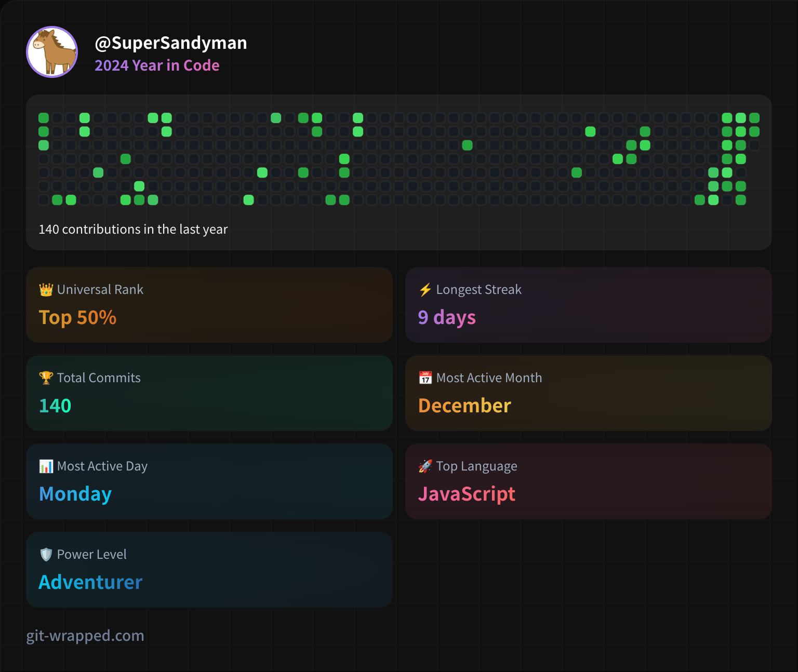

2024年の私の活動を雑にまとめましたお。

## GitHub
[Git Wrapped](https://git-wrapped.com/profiles/SuperSandyman)というGitHubの活動をまとめてくれるサイトから取得しました。

コミット数が140、上位50%だそうです。しょぼいですね。来年はもっとたくさん草を生やしたい...。

## 記事執筆
（この記事も含めて）当ブログでの記事の投稿数が5記事、Zennでの投稿数が2記事、合計7記事ということになりました。寂しいですね。まさか2桁にも達していないとは...。来年はもう少し投稿頻度を増やしたいなと思います。

## Misskeyのインスタンスを建てたよ
Misskeyのインスタンスを作ってみました。N100のミニPCをサーバーにして動かしていますが、今のところ普通に動作しています。気軽に投稿できていい感じです。

## 競馬
まったく当たりませんでした。

## 来年の目標
ブログに関しては、とりあえず今年の倍は書きたいなと思います。あとは、2週間くらい前にRustの学習を始めたのですが、それを使ってWeb Assemblyとかで何かを作ってみたいなと思っています。OSの自作とかもやってみたいですね。

## まとめ
以上、2024年の振り返りでした。来年からもよろしくお願いします。それでは！
