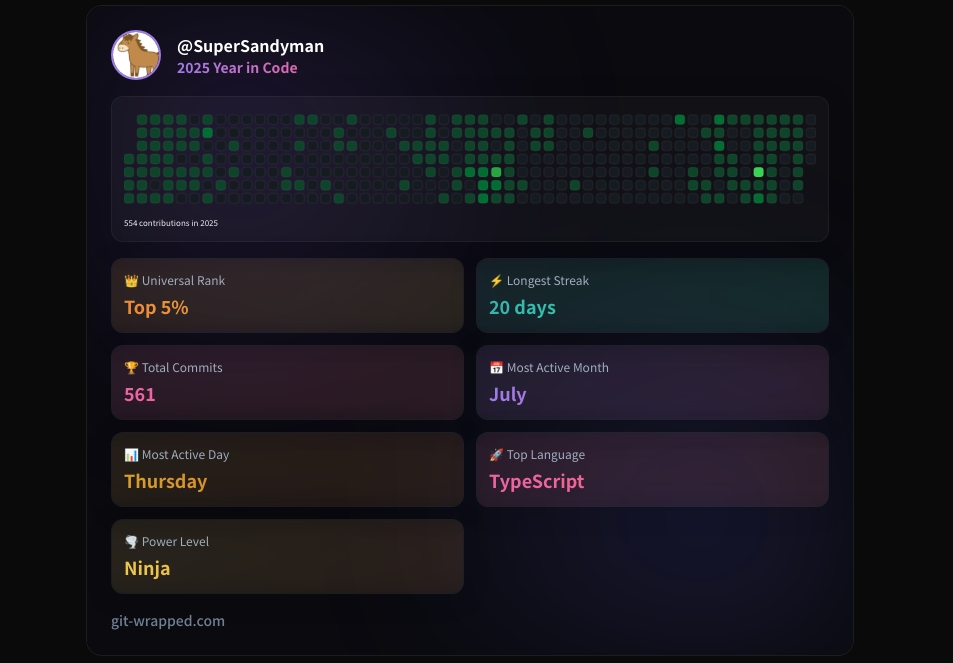

2025年の振り返りをしていきます。

## GitHub

[Git Wrapped](https://git-wrapped.com/profiles/SuperSandyman)より取得しました。コミット数は561（前年+421）、上位5%とのことです。かなり間が空いてしまった期間もありますが、去年より増やせたのでまずまずといったところではないでしょうか。

## 記事執筆
当ブログで6記事、Zennで1記事の合計7記事という結果になりました。去年と変わらない記事数になってしまいました。せっかくCMSも自作したので、来年はもう少し増やしたいなと思っています。

## 作ったもの
[InKraft](https://github.com/SuperSandyman/InKraft)というGitベースのCMSを自分用に作ってみました（というかAIに作らせた）。この記事も自作CMSで執筆していますが、スマホからも執筆ができてなかなか良いです。

あとは[自分用のしょぼいツール](https://github.com/SuperSandyman/dl-cleaner)を何個か作ったりしました。来年も頑張りたいですね。

## ブログのテーマを変えた
ブログのテーマをPaperModからHugo Narrowというやつに変えてみました。Tailwind CSSで構築されているテーマで、見た目がかっこよくなったのでいい感じです。

## 自宅サーバーがぶっ壊れた
去年の10月くらいに導入した中華ミニPCの自宅サーバーが無事ぶっ壊れました。SSDが粗悪なものだったみたいです。幸いデータ救出はできたのですが、替えのSSDがかなり高騰していてまだ購入できていないという...。なんとかしたいところではあります。

## 競馬
外しまくりました。

## まとめ
ということで、2025年の振り返りでした。来年もよろしくお願いします！それでは！
