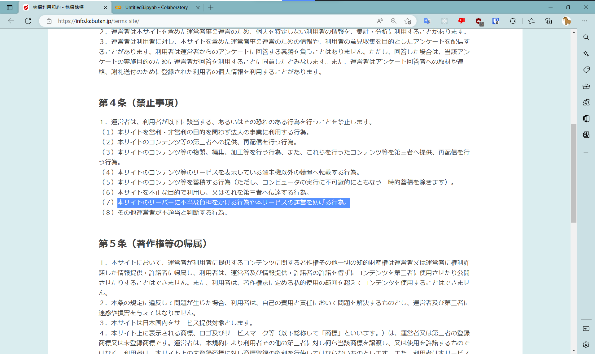

## 茶番
A「ああああああ！！！同僚から「ハードオフの株価を10分に1回調べる仕事」を押し付けられた！また定時で帰れないよ...。」

？？？「キミ、大丈夫かい？」

A「あ、あなたは...！」

？？？「そう俺の名は...BeautifulSoupさ！！」

## はじめに
皆さんこんにちは！Sandyマンです！突然ですが、皆さんは上の例みたいな仕事を押し付けられたことはありませんか？（あるわけない）10分に1回株価を送信するなんて大変ですよね...。ということで、今回はBeautifulSoupというPythonのライブラリを使って、Webサイト上の色々な情報を収集してみようと思います！それではやっていきましょう！
（※スクレイピングが禁止されているサイトもあるので利用規約等を読んでから収集しましょう！！）

## Pythonの環境構築
まずは、Pythonの環境構築をしていきます。といっても今はGoogle Colabという便利なツールがあるので、それを使っていきます。Web上で使うことができてマルチプラットフォームなので誰でも使えちゃいます。（Googleアカウント必須）
[https://colab.research.google.com/?hl=ja](https://colab.research.google.com/?hl=ja)

ノートブックを作成したら、セルに`!pip install bs4 requests lxml`と入力し、必要なライブラリをインストールしていきます。出来たら環境構築は完了です！

## ハードオフの株価を取得
ということで、早速スクレイピングの方をやっていきましょう！今回は、[株探さん](https://kabutan.jp/)のサイトを（勝手に）使わせていただこうと思います！



（利用規約には、第4条に「（７）本サイトのサーバーに不当な負担をかける行為や本サービスの運営を妨げる行為。」とありますが、個人で数回やるのみで運営の妨げには当たらないと判断しました。）

コードはこんな感じです。
```python
# 各種ライブラリのインポート
from bs4 import BeautifulSoup as bs
import requests

# URLを指定、接続する
url = 'https://kabutan.jp/stock/?code=2674'
res = requests.get(url)

# 指定したサイトからHTMLを持ってくる
soup = bs(res.text, 'lxml')
# kabukaのクラスがついている要素を取り出し、そこからテキストを抜き出す
kabuka = soup.find('span', class_='kabuka').text

# 表示する
print(f'今日のハードオフの株価は{kabuka}です。')
```
コードの内容はコメントの通りです。かなり少ない記述量でスクレイピングを行うことができる、ということがわかりますね。

## Weblio辞書を取得
次は、[Weblio辞書さん](https://www.weblio.jp)から言葉の意味などを取得していきたいと思います。WeblioのページのURLというのは、基本的に「weblio.jp/content/○○」という形になっています。それを基に関係者に事前教育をコードを書いていこうと思います。ということでこんな感じになりました。
```python
# ライブラリを呼び出す
from bs4 import BeautifulSoup as bs
import requests

# 検索する単語を聞く
words = str(input("検索ワード>>>"))

# URLを指定、アクセス
url = 'https://www.weblio.jp/content/' + words
res = requests.get(url)

# Beautifulsoupでいい感じに取り出す
soup = bs(res.text, 'lxml')
# 意味のところを取り出す
imi = soup.find("div", class_="Sgkdj").text

# 表示する
print(imi)
```
さっきと変わったところが、inputを使って検索単語を選択できるようにしたところですね。さっきのハードオフの例でも株の番号？みたいなのがURLにあるので、そこを変えたら他の会社の株価も表示することができるかもしれませんね。知らんけど...。

## まとめ
ということで、今回はいろいろなもののスクレイピングに挑戦してみました！どうだったでしょうか？他にもいろいろな場面で応用できると思うので、ぜひ皆さんもPythonをやってみてほしいなと思います！それではさようならーーーーーーーー！

☆Youtube始めたから誰か見て...。
[SandyマンのPC部](https://youtube.com/@sandyman_linux)

