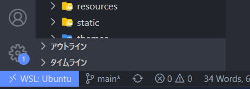
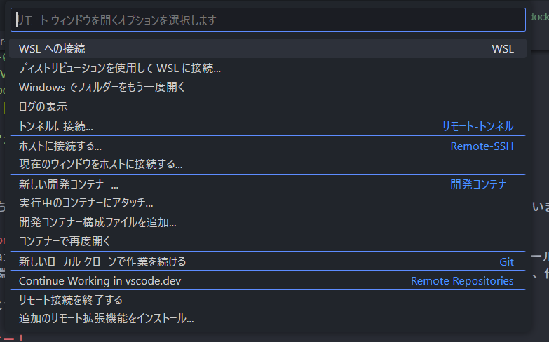
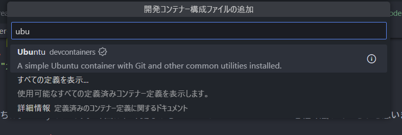

皆さんこんにちは。Sandyマンです。今回は、今更ながらVSCodeのRemote Containerを軽く触っていこうと思います。それではやっていきます！

## Remote Containerの概要
Remote Containersは、Dockerコンテナ内でコードを直接編集、実行するための機能。これにより、必要なツールや依存関係を含む完全な開発環境をコンテナとして定義し、その環境をVS Codeで直接利用することが可能となる。これにより、開発環境を簡単にセットアップし、他の開発者と共有することができる。

...という感じです。

## 使ってみよー！
では早速使ってみます！今回は、WSL2上にUbuntuのイメージを作る感じでやっていきます！また、Remote Containerを使うには、Remote Development（またはDev Containers）の拡張機能が必要です。WSL2を使ってる人は、もう既にRemote Developmentを入れているかと思いますが、入れていない方は入れておきましょう！

とりあえずまずは、WSL2上に空のディレクトリを作っておきます。名前はなんでもいいです。作ったら、下のバーのところにある**WSL: Ubuntu**みたいなところをクリックします。

そうしたら、こんな感じのやつが出てくるので、**開発コンテナー構成ファイルを追加**をクリックします。

すると、なんか色々出てくるので上の検索窓に「ubuntu」と打って出てきたやつをクリックします。バージョンとかも聞かれますが、最新のやつで大丈夫です。

後は少し経った後にコンテナが立ち上がって、コンテナの中にいるはずです。ターミナルを開くとコンテナ内のUbuntuが使えると思います。

## まとめ
ということで、今回はRemote Containerを使ってみるだけでした。こんな感じで、簡単にローカルを汚さず開発ができるので便利ですね！それではさようならーーーーーーーー！

（**Remote ContainerはメモリもCPUも結構食うのでそれだけ注意**）