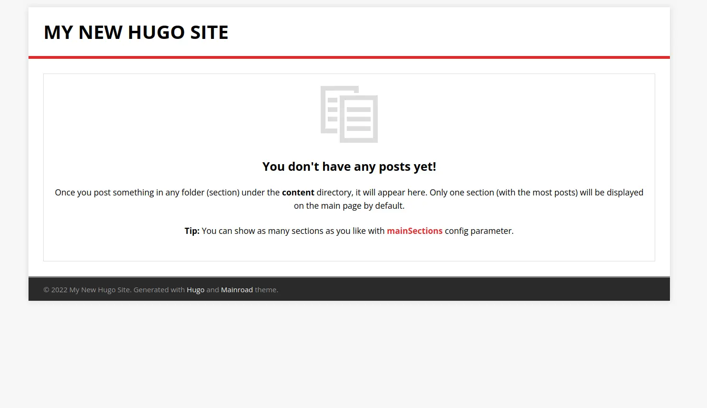

皆さんこんにちは、Sandyマンです！

突然ですが、皆さんは「ブログを作りたい」と思ったことはありませんか？（唐突）ありますよね？？ですが、WordPressで作ると、ドメイン代＋サーバー代がかかってしまいます...。そんなときの救世主がそう、**静的サイトジェネレータ**です！

ということで、今回は静的サイトジェネレータ（以下SSG）であるHugoを使ってでブログを作っていきます！それではやっていきましょう！

## 実施環境
- OS Linux 5.18（Manjaro）

## 1.環境構築
まず、Hugoのパッケージをインストールします。Linux環境の方は、`sudo apt install hugo`という感じでインストールできます。

WindowsやMacの方は、ChocolateyやHomeBrew？とかを使っていい感じにやってください。（要はggrks）

## 2.ブログの作成
それでは、ブログを作っていきます！ターミナルを開いて、`hugo new site myblog`というコマンドを実行します。（myblogのところは自由に変えてください）
すると、`myblog`というフォルダ内にいろいろファイルが生成されたはずです！これで一応ブログはできました！

## 3.テーマの追加
ですが、これだけだとブログとして使い物になりません。なぜかというと、レイアウトを整えたりする「テーマ」がないからです。テーマは自分で作ることもできますが、Hugoの公式サイトにいろいろなテーマが紹介されています。今回は、結構人気なMainroadというテーマを使用してみます。

まず、MainroadのGitHubに飛んでReadmeのところにあるコマンドを実行します。git cloneのやつとgit submoduleのやつの2つが書いてありますが、ここでは**submoduleの方のコマンド**を実行してください！

実行したら、myblog直下の`config.toml`というファイルの中身を変更します。初期状態では3行記述されていますが、そこに`theme = "mainroad"`と付け足してください。

付け足したら、myblogにcdして`hugo server -D`というコマンドを実行します。ブラウザでlocalhost:1313にアクセスすると、いい感じのブログになっていると思います。これでテーマの追加は完成です！

## 4.記事の作成
次は、記事の作成の方法です！Hugoで記事を作成する際は、`hugo new posts/hogehoge.md`というコマンドを実行します。実行すると自動的にcontent直下に`posts`というフォルダが作成され、その中にhogehoge.mdが入っているはずです。あとはマークダウン形式で書いていけば完成です！

## 5.アップロード
いよいよ最後です。テーマも追加し記事もできたら後はアップロードするだけです。アップロードする際はNetlifyとかAWSとかいろいろありますが、個人的にはVercelをおすすめします。Vercelは、GitHubにプッシュすると自動でいろいろやって公開してくれ、さらに無料で使えるのでめちゃくちゃおすすめです！

## 本当に安くて速いのか？
本当に安くて速いのか？と思う方もいると思うので、その辺に転がっていたデータでWordPressと比較してみます。（雑なのであまり参考にしないでください）

まず、WordPressはドメイン代、サーバー代、そしてテーマも買う場合はテーマ代もかかります。ドメインは年2000円だとして、サーバー代が有名なエックスサーバーのやつで月990円、テーマは無料のもありますが有料の場合、1万円くらいはかかります。計算すると1年でだいたい、**25000円**くらいかかります。

それに比べHugoを利用した場合、サーバー代は無料、テーマもタダ、ドメインは年2000円くらいで済みます。つまり合計**年2000円**ですね。これはかなり安いのではないでしょうか？

速度も動的サイトであるWordPressに比べて、Hugoのほうが高速です。このことから、Hugoでのブログは**本当に安くて速い**といえますね！（間違ってたらすみません）

## まとめ
ということで、HugoとVercelでブログを作ろうでした！皆さんもぜひ、HugoとVercelで最高のブログライフを手にしてみてください！それではさようならーーーー！！
