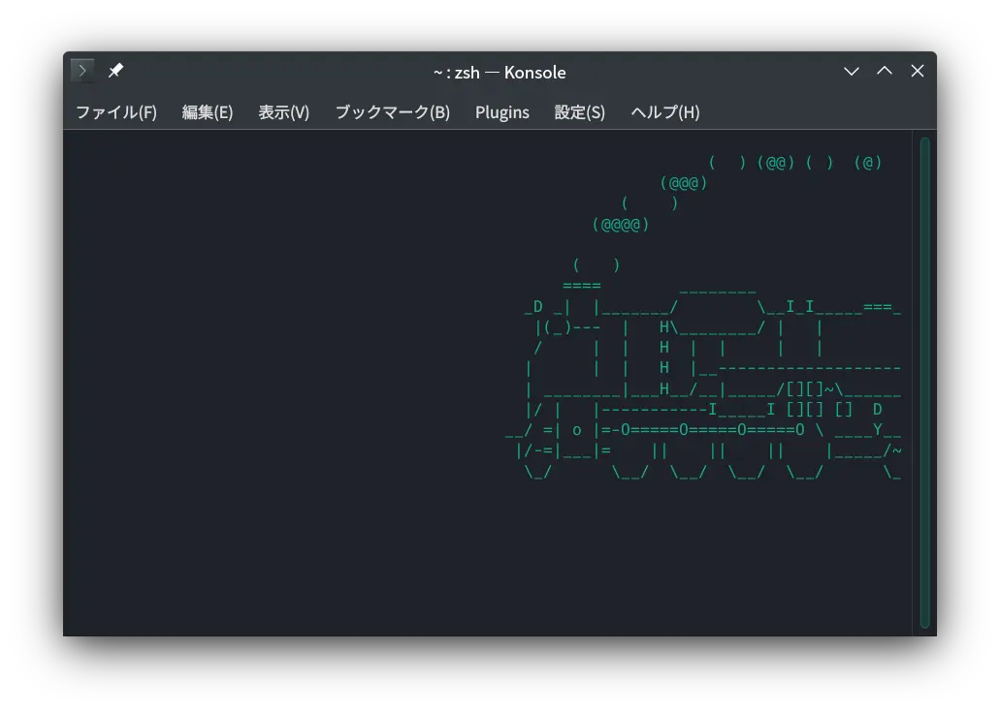
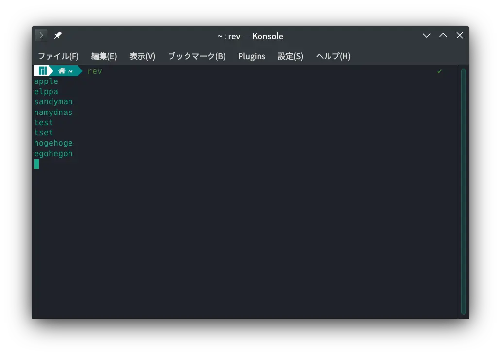
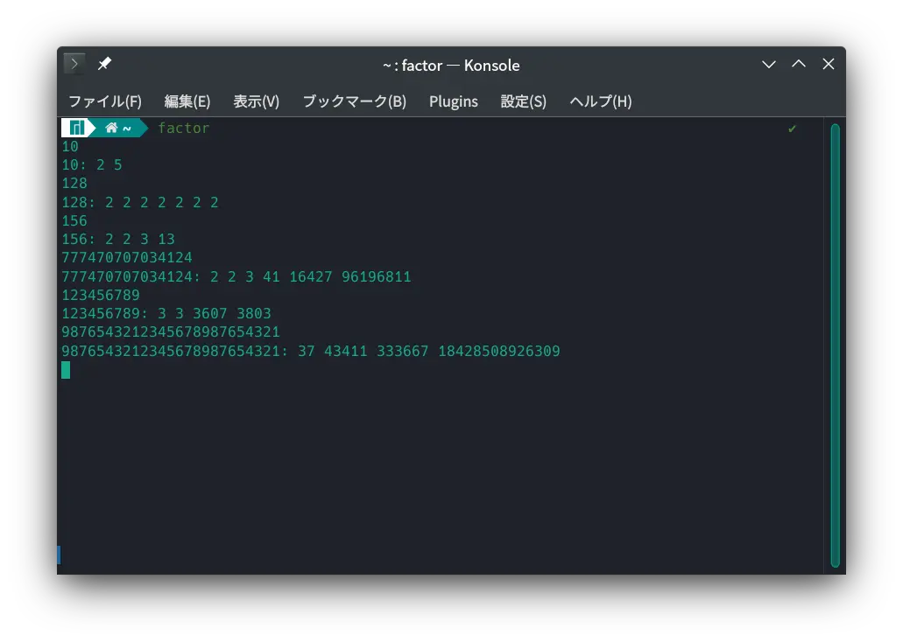
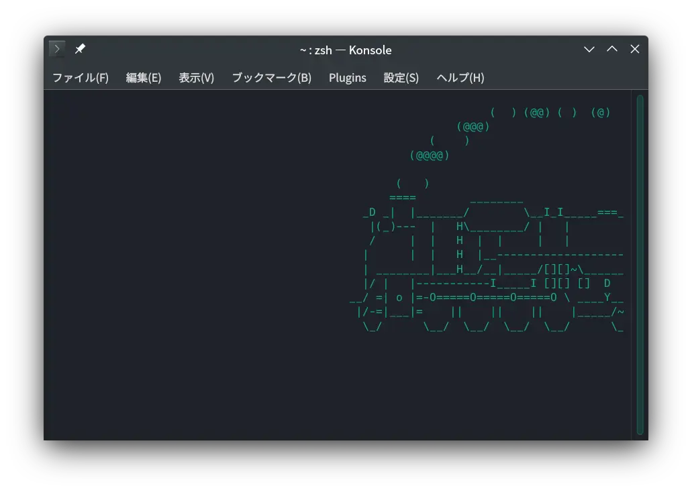
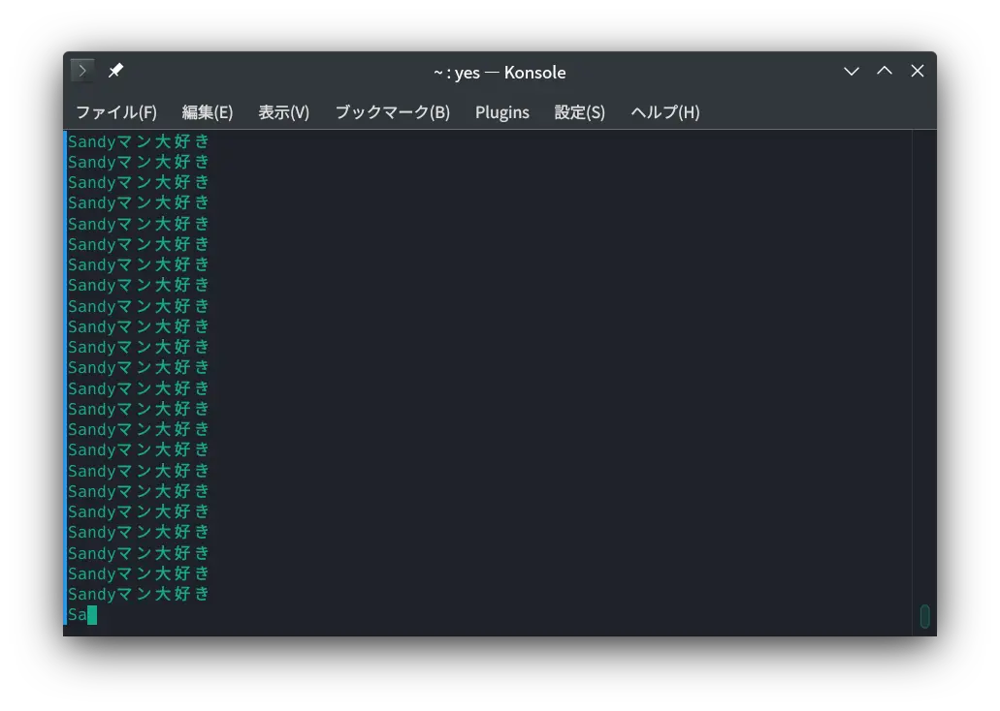

皆さんこんにちは！Sandyマンです！

いきなりですが、今暇ですか？私は暇です（？？？）そんなときにすることといえば？そう！LInuxのコマンドですね☆

ということで今回は、**暇つぶしになる面白いLinuxのコマンド**を5つ紹介します！それではやっていきましょう！

## 1. sl

これは結構有名なコマンドですね。Ubuntu系の方は`sudo apt install sl`でインストールすることができます。

使い方は、ターミナルに`sl`と打つだけです。ターミナルの中を機関車が走り回ります。癒やされますね☆

## 2. rev

このコマンドはLinux標準搭載なので、インストールをしなくても実行できます！`rev`と打ち実行すると入力が可能な状態になります。後は、何かてきとうに打てばこんな感じで反転して返ってきます。~~つまんな~~

## 3. factor

このコマンドは、いい感じに素因数分解をしてくれるらしいです。これもインストールしなくても使えるので、`factor`と打って実行します。てきとうな正の整数を打つと素因数分解してくれます。素因数分解をしないといけない学生さんにおすすめです！

## 4. cowsay

名前の通り、「牛が話す」コマンドです！Ubuntu系の方は`sudo apt install cowsay`でインストールします。使い方は、`cowsay 言わせたい言葉`です。かわいい牛さんがお話してくれます！残業で疲れている人はこれで癒やされましょう！

## 5. yes

これも標準搭載されているコマンドです。`yes`の後に何かを打って実行すると、打った文字がぶわーーっと流れてきます。このコマンドは、`ctrl + c`じゃないと止められないので気をつけてください！

## まとめ

ということで、面白いコマンド5選でした！皆さんも暇なときや疲れたときにぜひやってみてください！それではさようならーーーー！！