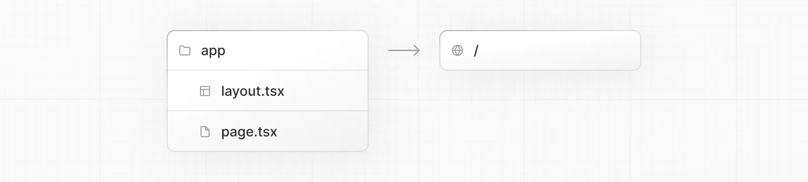

（コードはすべてTypeScriptです。Deeplなどで翻訳しました）

元のドキュメント
[Getting Started: Installation | Next.js](https://nextjs.org/docs/getting-started/installation)

システム要件
- Node.js 16.8以降
- MacOS、Windows（WSLを含む）、Linuxに対応

## Automatic Installation（自動セットアップ）
`create-next-app`を使用して、新しいNext.jsアプリを作成することをお勧めします。これを使うとすべて自動的にセットアップしてくれます。プロジェクトを作成するには、以下を実行します。
```shell
npx create-net-app@latest
```
インストール時に、以下のプロンプトが表示されます。
```shell
What is your project named? my-app
Would you like to add TypeScript with this project? Y/N
Would you like to use ESLint with this project? Y/N
Would you like to use Tailwind CSS with this project? Y/N
Would you like to use the `src/ directory` with this project? Y/N
What import alias would you like configured? `@/*`
```
Next.jsでは、デフォルトでTypeScript、ESLint、およびTailwind CSSの設定が含まれています。また、アプリケーションコードに`src`ディレクトリを使用するように選択することもできます。

プロンプトが表示された後、`create-next-app`はプロジェクト名のディレクトリを作成し、必要な依存関係をインストールします。

Note: 新しいプロジェクトでPages Router（従来のやつ）を使用することはできますが。Reactの最新機能を活用するために、App Routerで新しいアプリケーションを始めることをお勧めします。

## Manual Installation（手動でのセットアップ）
新しいNext.jsアプリを手動で作成する場合は、必要なパッケージをインストールします。
```shell
npm install next@latest react@latest react-dom@latest
```
`package.json`を開き、以下のスクリプトを追加します。
```json
{
  "scripts": {
    "dev": "next dev",
    "build": "next build",
    "start": "next start",
    "lint": "next lint"
  }
}
```
これらのスクリプトは、アプリケーションの開発のさまざまな段階を指しています。

- dev：next devを実行し、Next.jsを開発モードで開始します。
- build: next buildを実行して、実運用に向けたアプリケーションを構築します。
- start: next startを実行して、Next.jsのプロダクションサーバーを起動します。
- lint: next lintを実行して、Next.jsの組み込みESLint設定を行います。

### Create the app folder（appディレクトリの作成）
次に、appディレクトリを作成し、`layout.tsx`と`page.tsx`ファイルを追加します。これらは、ユーザーがアプリケーションのルートにアクセスしたときにレンダリングされます。

`app/layout.tsx`の中に、必要な`<html>`タグと`<body>`タグを含むルートレイアウトを作成します。
```typescript
export default function RootLayout({
  children,
}: {
  children: React.ReactNode;
}) {
  return (
    <html lang="en">
      <body>{children}</body>
    </html>
  );
}
```
最後に、いくつかの初期コンテンツを含むホームページ`app/page.tsx`を作成します。
```typescript
export default function Page() {
  return <h1>Hello, Next.js!</h1>;
}
```
Good to know（知っておいて損はない）：`layout.tsx`の作成を忘れた場合、`next dev`で開発サーバーを実行すると、Next.jsが自動的にこのファイルを作成します。 

### Create the public folder（publicディレクトリの作成）
画像やフォントなどの静的資産を保存するために、オプションでpublicディレクトリを作成することができます。publicディレクトリ内のファイルは、ベースURL（/）から始まるコードで参照することができます。

## Run the Development Server（開発サーバーの起動）
`npm run dev`を実行して、開発サーバーを起動します。`http://localhost:3000`にアクセスし、アプリケーションを表示します。
'app/layout.tsx'または'app/page.tsx'を編集して保存すると、ブラウザで更新された結果が表示されます。

まとめはこちら
[Next.js(App Router)のドキュメント日本語訳まとめ](../nextjs-approuter-document-ja)