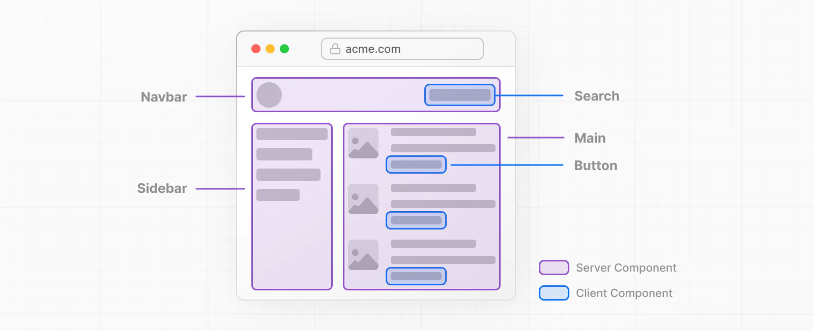
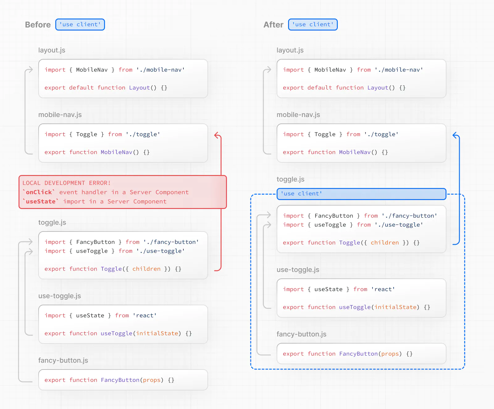

## はじめに
本記事は、Next.js 13.4（App Router）のドキュメントをDeepl翻訳にて日本語に直したものです。コードはすべてTypeScriptの場合のものを掲載しています。元の記事はこちらです→[Getting Started: React Essentials | Next.js](https://nextjs.org/docs/getting-started/react-essentials)

## React Essentials
Next.jsでアプリケーションを構築するには、Server ComponentsなどのReactの新機能に精通していることが必要です。このページでは、Server ComponentとClient Componentの違い、使うタイミング、おすすめのパターンについて説明します。

また、Reactを初めて使う場合は、React Docsを参照することをお勧めします。学習に最適なリソースはこちらです。

- [Tutorial: Tic-Tac-Toe – React](https://react.dev/learn/tutorial-tic-tac-toe)
- [Thinking in React – React](https://react.dev/learn/thinking-in-react)
- [Describing the UI – React](https://react.dev/learn/describing-the-ui)

## Server Components
Server and Client Componentsにより、開発者はサーバーとクライアントにまたがるアプリケーションを構築し、クライアントサイドのアプリケーションの豊かなインタラクティブ性と従来のサーバーレンダリングの改善された性能を組み合わせることができます。

### Thinking in Server Components（サーバーコンポーネントについて考える）
ReactがUI構築の考え方を変えたように、React Server Componentsは、サーバーとクライアントを活用するハイブリッドアプリケーションを構築するための新しいメンタルモデルを導入しています。

Reactは、アプリケーション全体をクライアントサイドでレンダリングするのではなく（シングルページアプリケーションの場合など）、目的に応じてコンポーネントをレンダリングする場所を柔軟に選択できるようになりました。

たとえば、アプリケーションの1ページを考えてみましょう。


ページを小さなコンポーネントに分割してみると、大半のコンポーネントは非インタラクティブで、Server Componentsとしてサーバー上でレンダリングできることに気づきます。インタラクティブなUIの小片には、クライアントコンポーネントを散在させることができます。これは、Next.jsのサーバーファーストのアプローチに沿ったものです。

### Why Server Components?（なぜサーバーコンポーネントなのか？）
では、なぜServer Componentsなのかとお考えでしょう。クライアントコンポーネントと比較して、サーバーコンポーネントを使うメリットは何なのでしょうか？

Server Componentsを使うと、開発者はサーバーのインフラをうまく活用することができます。例えば、従来はクライアントでJavaScriptのバンドルサイズに影響を及ぼしていた大きな依存関係を、サーバーに完全に残すことができるため、パフォーマンスの向上につながります。また、Reactアプリケーションの作成は、PHPやRuby on Railsに近い感覚で行えますが、Reactのパワーと柔軟性、そしてUIをテンプレート化するコンポーネントモデルも利用できます。

サーバーコンポーネントを使用すると、最初のページロードが速くなり、クライアントサイドのJavaScriptバンドルサイズが縮小されます。クライアントサイドの基本的なランタイムは、キャッシュ可能でサイズも予測可能であり、アプリケーションの成長に合わせて増加することはありません。追加のJavaScriptは、クライアントコンポーネントを通じてアプリケーションでクライアントサイドのインタラクティブ機能が使用される場合にのみ追加されます。

Next.jsでルートがロードされると、最初のHTMLがサーバーにレンダリングされます。このHTMLはブラウザ上で徐々に拡張され、Next.jsとReactのクライアントサイドランタイムを非同期にロードすることで、クライアントがアプリケーションを引き継いでインタラクティブ性を追加することができます。

Server Componentsへの移行を容易にするため、App Router内部のコンポーネントは、特殊なファイルやコロケーションコンポーネントを含め、デフォルトですべてServer Componentsとなっています。これにより、余分な作業をすることなく自動的に採用することができ、すぐに優れたパフォーマンスを実現することができます。また、「use client」ディレクティブを使用して、オプションでClient Componentsにオプトインすることも可能です。

## Client Components（クライアントコンポーネント）
Client Componentsを使用すると、アプリケーションにクライアントサイドのインタラクティブ性を追加することができます。Next.jsでは、クライアントコンポーネントは、サーバーでプリレンダリングされ、クライアントでハイドレーションされます。クライアントコンポーネントは、Pagesルーターのコンポーネントが常に機能しているのと同じだと考えることができます。

## The "use client" directive
`"use client"`は、ServerとClient Componentのモジュールグラフの境界を宣言するための規約です。
```typescript
// app/counter.tsx
'use client';
 
import { useState } from 'react';
 
export default function Counter() {
  const [count, setCount] = useState(0);
 
  return (
    <div>
      <p>You clicked {count} times</p>
      <button onClick={() => setCount(count + 1)}>Click me</button>
    </div>
  );
}
```



`"use client"`は、サーバー専用コードとクライアントコードの間に位置します。ファイルの一番上、importの上に置かれ、サーバーオンリーからクライアント部分への境界を越えるカットオフポイントを定義します。一旦 `"use client"`がファイル内で定義されると、子コンポーネントを含む、そのファイルにインポートされた他のすべてのモジュールは、クライアントバンドルに含まれるとみなされます。

サーバーコンポーネントはデフォルトなので、`"use client"`指令で始まるモジュールで定義またはインポートされない限り、すべてのコンポーネントはサーバーコンポーネントのモジュールグラフの一部となります。

Good to know: 
- Server Componentモジュールグラフのコンポーネントは、サーバー上でのみレンダリングされることが保証されています。
- Client Componentモジュールグラフのコンポーネントは、主にクライアントでレンダリングされますが、Next.jsでは、サーバーでプリレンダリングし、クライアントでハイドレーションすることも可能です。
- `"use client"`ディレクティブは、インポートする前に、ファイルの先頭で定義する必要があります。
- `"use client"`は、すべてのファイルで定義する必要はありません。クライアントモジュールの境界は、「エントリーポイント」で一度だけ定義する必要があり、そこにインポートされたすべてのモジュールがクライアントコンポーネントとみなされるようにするためです。
