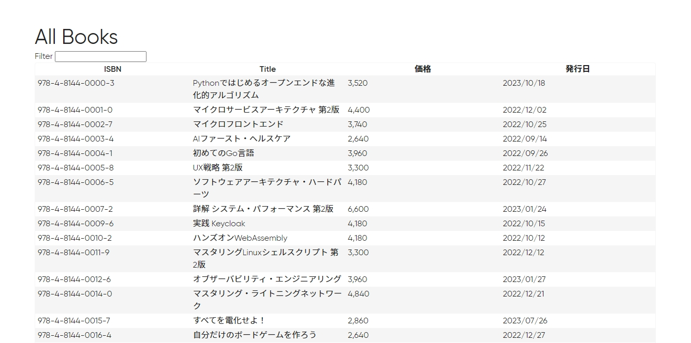

「リーダブルコード」や「ゼロから作るDeep Learning」などの技術書で有名なオライリーさん、読んだことのある人も多いはずです。プログラミングから料理まで、いろいろな本が出版されていますが、今までに出版された本をすべて購入したらいくらになるのでしょうか？調べてみました。

## 調べ方

オライリーの発行書籍一覧（[https://www.oreilly.co.jp/catalog/](https://www.oreilly.co.jp/catalog/)）をPythonでスクレイピングして調べました。今回、「JavaScript 第7版」などの更新されている書籍は最新のものだけを対象にしています。

## ソースコード
```python
import requests
from bs4 import BeautifulSoup

res = requests.get('https://www.oreilly.co.jp/catalog/')
soup = BeautifulSoup(res.text, 'html.parser')

price_elements = soup.select('#bookTable > tbody > tr > td.price')

prices = [price.get_text(strip=True) for price in price_elements]

books_length = len(prices)

total_sum = sum(float(price.replace(',', '')) for price in prices)

print("書籍数：", books_length, "冊")
print("合計金額：", total_sum, "円")
```
（多分動く）

## 実行結果
```
書籍数： 412 冊
合計金額： 1509200.0 円
```

## まとめ
ということで、オライリー本を全冊買うと**1509200円**かかることがわかりました。高いですね。どれもいい本なので仕方ないんですけどね。お財布に余裕のある方はぜひ全冊揃えてみては？（破産する）

それでは！