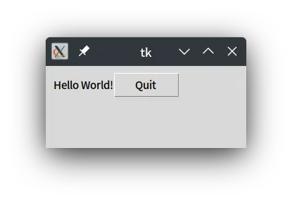
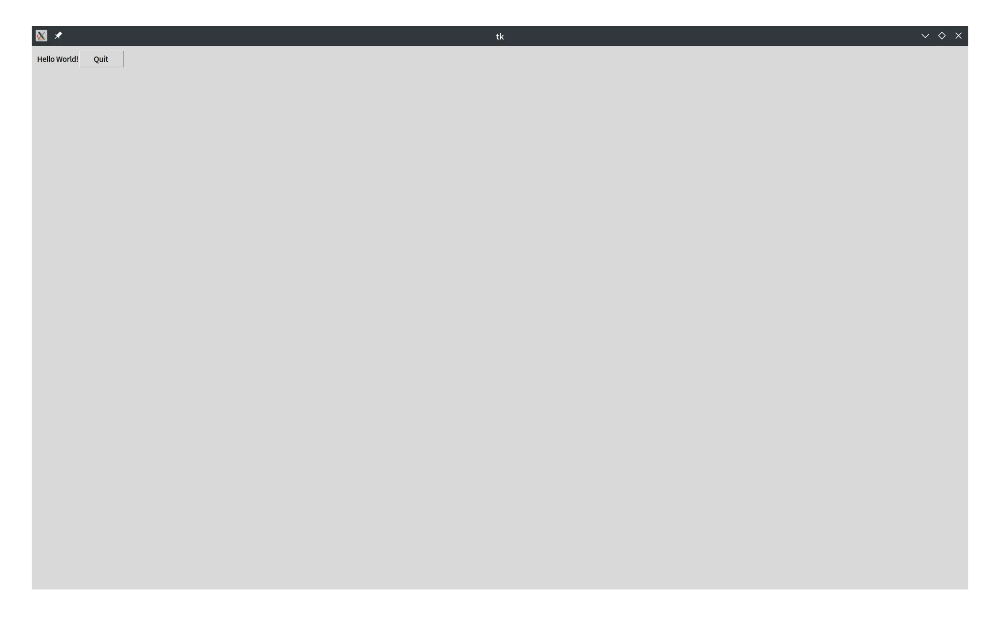

## はじめに
皆さんこんにちは！Sandyマンです！

今回は、Pythonの標準ライブラリである「Tkinter」を<!--more-->使ってお手軽にGUIアプリケーションを作ってみようと思います！それではやっていきます！

## 実施環境
- OS Manjaro Linux
- ThinkPad X1 Carbon Gen10
- Python 3.10.6

## なぜか動かない
早速試そうと思ったら、こんなエラーが出てなぜか動きませんでした。
```
Traceback (most recent call last):
File "/home/sandyman/python/thinker_test/app.py", line 2, in <module>
import tkinter as tk
File "/usr/lib/python3.10/tkinter/init.py", line 37, in <module>
import _tkinter # If this fails your Python may not be configured for Tk
ImportError: libtk8.6.so: cannot open shared object file: No such file or directory
```
調べてみると、なぜかTkinterがインストールされていないようです。Arch系の人は`sudo pacman -S tk`でインストールしたあとに、venvを作り直せば動くそうです。実際これで動きました！

## とりあえず動かす
では、とりあえず何か書いて動かしてみます。app.pyを作成してドキュメントを見ながら書いてみます。まずは毎度おなじみHello, World!からやってみます。
```python
from tkinter import *
from tkinter import ttk
root = Tk()
frm = ttk.Frame(root, padding=10)
frm.grid()
ttk.Label(frm, text="Hello World!").grid(column=0, row=0)
ttk.Button(frm, text="Quit", command=root.destroy).grid(column=1, row=0)
root.mainloop()
```
`python3 app.py`と打って実行すると...



少し見た目が古風なウィンドウが出てきます。出てきたら成功です！

## ウィンドウのサイズ指定をしてみる
次はウィンドウのサイズを指定してみようと思います！さっきのコードに、`root.geometry("300x400")`というのを付け加えます。保存して実行してみるとさっきよりも大きくなっているはずです。

最大化したい場合は、`root.attributes("-zoomed", "1")`を付け加えます。(LinuxやMacのみ)



するとこんな感じのバカでかいウィンドウが出てきます。

## まとめ
ということで今回は、Tkinterで簡単にGUIアプリケーションを作ってみました！そのうち他のライブラリと連携してみた的なやつもやるので、そちらもよろしくお願いします！それではさようならーーーー！！！


