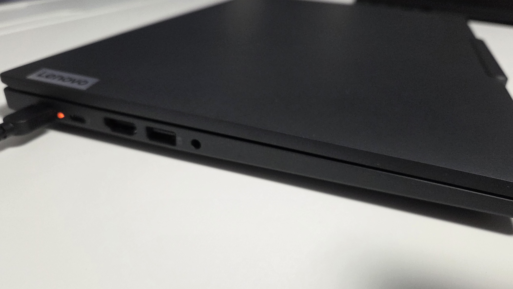

前回[こんな記事](https://www.sandyman.dev/posts/buy-thinkpad-t14g6/)を書いたわけですが、その後1週間くらいで本体が到着し、今日までそれなりに使ってきたので、軽くレビューっぽいことをしていきます。内容は前まで使っていたThinkPad X1 Carbon Gen10との比較が多めになっています。

## 購入したマシンのスペック
- ThinkPad T14 Gen6 ILL
- Intel Core Ultra 7 258V
- RAM 32GB
- SSD 256GB
- 非光沢WUXGA液晶（sRGB100%）
- バックライト付き英語配列キーボード

## 開封

本体は主に樹脂素材でできている感じです。ついこの間まで使っていたX1 Carbonはカーボンファイバー製の筐体だったので、それに比べると質感の良さではやや劣っている印象です。

厚さに関しても、X1 Carbonと並べて置くとはっきりわかるくらいにはT14のほうが分厚いです。重さもT14のほうが数百グラム重いのですが、持ち運びは普通に可能な程度の重さです。

キーボードは英語配列のものにしました。キーへの印字が少なく、全体的にスタイリッシュな印象を受けます。記号部のキーピッチが日本語配列よりもゆとりがあって、かなり良い感じです。

## 分解する
今回は、X1 Carbonに積んでいたSSDを移植する前提でストレージを256GB構成にしたので、分解（といっても裏蓋を開けるだけ）してSSDを交換してみました。

本体内部はこのような感じになっていました。冷却用のファンが1つしかなくて、少し心もとない印象です。今回買ったLunar Lake搭載機はメモリがCPUに統合されているので、メモリの交換は不可能な仕様となっています。メモリをあとから増やしたい人は、Arrow LakeかAMDのRyzen搭載機にしたほうが賢明でしょう。

X1 Carbonから取り外したSSDに交換して作業は終了です。

## 性能・ベンチマーク
<blockquote class="twitter-tweet">
特に条件は変えずに再挑戦した結果。これくらいならまあ許せる。 <a href="https://t.co/4ggCQaNhJ2">pic.twitter.com/4ggCQaNhJ2</a>
&mdash; Sandyマン (@sandyman_linux) <a href="https://twitter.com/sandyman_linux/status/1979187504902193660?ref_src=twsrc%5Etfw">October 17, 2025</a></blockquote>  

CINEBENCH R23の測定結果です。同じCPUを積んだ他機種のレビュー記事ではスコアが10000近く出ているので、それと比べるとT14のスコアはやや低めといえそうです。とはいえ、通常利用で困ることはまずないと思います。

## Linuxをぶち込む
それでは早速Linuxを導入していきます。とはいっても、Linuxは外付けSSDにインストールしているので、それを挿して再起動すれば終わりです。

## 良いところ
### バッテリーが持つ
購入前から「Lunar Lakeは電力効率が良い」という評判は聞いていましたが、実際にX1 Carbonと比べてもバッテリー持ちはかなり改善されていました。X1 Carbonは持って3時間くらいでしたが、T14は短くても6時間はいけるんじゃないかな？という感じです（使い方にもよると思いますが）。

### 分解しやすい
ThinkPadシリーズは[Lenovo公式の保守マニュアル](https://download.lenovo.com/pccbbs/mobiles_pdf/t14_g6_p14s_g6_t16_g4_p16s_g4_hmm_ja.pdf)も用意されていて、分解はとても簡単でした。ここまで分解に寛容なメーカーは、なかなかないように思います。

### Linuxとの相性が良い
最新のノートパソコンにLinuxベースのOSを導入すると、大抵は何らかの問題が起きるものですが[^1]、T14ではなぜか問題が一切発生せず、安定して使うことができました。もちろんディストロやLinuxカーネルのバージョンにもよると思いますが、かなり相性は良さそうです。

[^1]: 例えばX1 CarbonにLinux（UbuntuやManjaro）を導入したての頃は、謎のプチフリーズや意味不明なエラーが大量に出た記憶がある。なかなか地獄だった。

## 微妙なところ
### メモリを交換できない
これはメモリとCPUが一体化しているLunar Lakeの仕様上どうすることもできないのですが、メモリを32GBより多く積みたい人は、おとなしくArrow LakeやAMD機にしておいたほうが良さそうです。

### 排熱がやや弱い
CPUファンが1つしかないので、冷却はやや弱めです。できれば2つは欲しかったところです。

## まとめ
ということで、T14 Gen6 ILLのレビューでした。性能もまあまあ良く、値段も高すぎず、バランスの取れた優秀なマシンではないでしょうか。かなりおすすめです。それでは！
