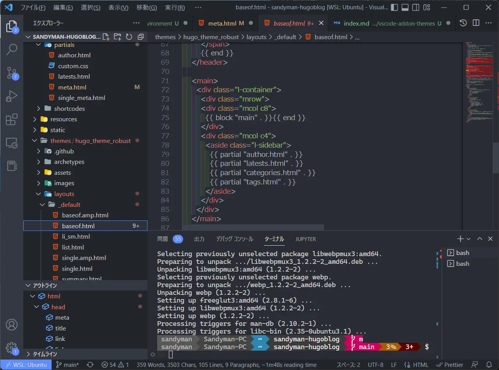

皆さんこんにちは！Sandyマンです！今回は、プログラマー御用達のエディタ「Visual Studio Code」（以下VSCode）のおすすめ拡張機能を紹介します！それではやっていきましょう！

## 1.indent-rainbow

画像のようにコードのインデントにわかりやすく色を付けてくれる拡張機能です！Sandyマン一押しの神拡張です！Pythonなどのインデントを多用する言語を使っている方におすすめです！

## 2.Material Icon Theme
VSCodeのアイコンを今時なデザインにできる拡張機能（どっちかというとテーマ）です。ファイルの種類とかがぱっと見でわかりやすくなるので結構おすすめです！

## 3.zenkaku
コードに紛れ込んだ全角スペースをわかりやすくしてくれる拡張機能です。これで予期せぬエラーに出会うことはなくなるかも？おすすめです！

## 4.Git History
GitをGUIで扱えるようになる拡張機能です！編集履歴などが視覚化されてわかりやすくなるのでまあまあおすすめです。

## 5.Atom One Dark

VSCodeのライバル的存在「Atom」のテーマが使えるよー、みたいなやつです。昔はAtom教を信仰していたので使ってます。見やすい色で作業も捗るのでおすすめです。

## まとめ
今回はVSCodeの拡張機能とテーマについてまとめてみました！皆さんもぜひindent-rainbowをインストールして使ってみてください！（他のも使ってみてね）それではさようならー！！！

